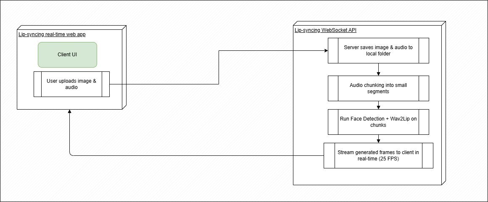
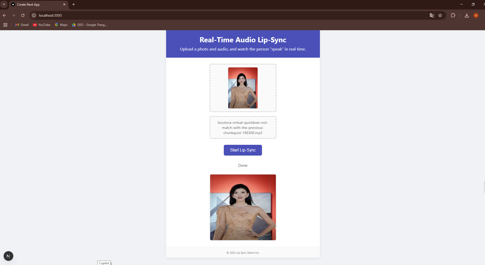
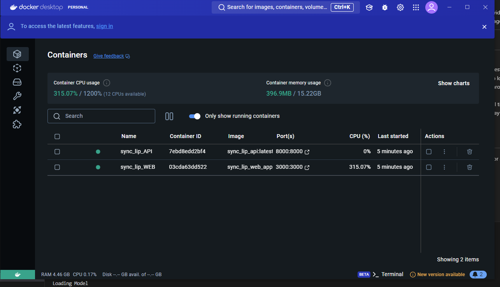

# Audio Lip Sync Projects

This repository contains two main components:

- **Sync-lip-api**: A FastAPI-based backend for animate video with lip in realtime.
- **audio-lip-web**: A Web app for submiting person image and audio.

---

# How system work

- Client and server connect with Websocket Fast api 
- User will upload image and audio to server and request server to animate a lip-synced video.
- Server when receive the image and audio will save to local folder and start generate frame.
- The audio will chunking into small chunk and pass through face detection model and wav2lip model to generate frames.
- The generated frames will be sent to the client in real time without having to wait for the entire audio to be generated and the client will display these frames continuously with fps of 25.

## 1. How to run API

A Python FastAPI application that provides API endpoints for audio-driven lip sync processing.


### Requirements

- Python 3.8
- See `requirements.txt` for dependencies.

### Setup & Run on Windows

```bash
cd Sync-lip-api
python -m venv venv
venv\Scripts\activate
pip install -r requirements.txt
uvicorn main:app --host 0.0.0.0 --port 8000
```

### Docker

```bash
docker build -t sync_lip_api:latest .
docker run --name sync_lip_API -p 8000:8000 sync_lip_api:latest
```

### Notes
- API runs by default on [http://localhost:8000](http://localhost:8000).
- FastAPI endpoint for upload image and audio http://localhost:8000/upload_image
---

## 2. audio-lip-web

A Web app for submiting person image and audio.

### Features

- Upload audio files and image files 
- View lip-synced results.



### Requirements

- Node.js 18+
- npm

### Setup & Run

```bash
cd audio-lip-web
npm install
npm run dev
```

Open [http://localhost:3000](http://localhost:3000) in your browser.

### Docker

```bash
docker build -t sync_lip_web_app:latest .
docker run --name sync_lip_WEB -p 3000:3000 sync_lip_web_app:latest
```

---

## Project Structure

```
Sync-lip-api/      # FastAPI backend
audio-lip-web/     # Next.js frontend
```
---

